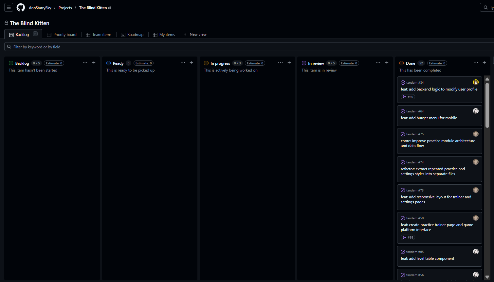

# The Blind Kitten

**“The Blind Kitten”** is a platform for beginner programmers.  
It offers levels from easy to advanced, a glossary of terms, gamified practice, and skills for real-world work.

## Participants

- **Angelina** ([angelinavakkasova](https://github.com/angelinavakkasova)) — [Diary](https://github.com/AnnStarrySky/tandem/tree/main/development-notes/angelinavakkasova)
- **Anna** ([annstarrysky](https://github.com/annstarrysky)) — [Diary](https://github.com/AnnStarrySky/tandem/tree/main/development-notes/annstarrysky)
- **Yuriy** ([yuriyli](https://github.com/yuriyli)) — [Diary](https://github.com/AnnStarrySky/tandem/tree/main/development-notes/yuriyli)

## Deploy:

- https://tandem-pi.vercel.app/

## Backend:

- https://github.com/Yuriyli/TandemBackend

---

## DEMO-video

- https://youtu.be/yf5TQrXvOPQ?si=puk44Rpz1MJ3tRi3

---

## What we are proud of

Мы гордимся тем, что **“The Blind Kitten”** выглядит как настоящий продукт, а не просто набор изолированных страниц.  
Во-первых, нам удалось собрать цельный пользовательский путь. Пользователь не просто открывает страницу и что-то нажимает — он проходит через понятный сценарий: авторизация → dashboard → выбор темы → выбор сложности → выполнение задания → результат → настройки. Всё это связано между собой и ощущается как единая система.

Во-вторых, мы не ограничились одним типом заданий. В проекте реализовано несколько форматов тренажёров: квизы, дополнение кода и полноценный редактор. Это усложнило реализацию, но сделало обучение более разнообразным и интересным.

Отдельно хочется отметить внимание к пользовательскому опыту. Мы добавили:

- переключение темы (light / dark)
- смену языка
- звуковой отклик
- анимации и визуальный фидбек (включая конфетти)

Это мелкие детали, но именно они делают интерфейс более “живым” и приятным.

Также важно, как проект вырос архитектурно. В начале это были просто страницы, но со временем появилась структура (app / entities / features / widgets / shared), разделение логики и UI, переиспользуемые компоненты и более аккуратная организация кода.

И, наверное, самое важное — это командная работа. Было непросто: разные подходы, разные идеи, иногда споры. Но именно это помогло сделать проект лучше. Мы научились договариваться и собирать единый результат.
Если коротко: мы гордимся тем, что из идеи у нас получилось собрать цельное, логичное и приятное в использовании приложение.

---

## Kanban-Board

- [GitHub Project Board](https://github.com/users/AnnStarrySky/projects/3/views/1)

> 

---

## Meeting Notes

- [Meeting 01 — Первое обсуждение проекта](./meeting-notes/meeting-01.md)
- [Meeting 02 — Выбор стека и распределение задач](./meeting-notes/meeting-02.md)
- [Meeting 03 — Обновление статуса по задачам](./meeting-notes/meeting-03.md)
- [Meeting 04 — Дальнейшие шаги и уточнение задач](./meeting-notes/meeting-04.md)
- [Meeting 05 — Финальный статус и завершение проекта](./meeting-notes/meeting-05.md)

---

## PR

- [#79](https://github.com/AnnStarrySky/tandem/pull/79)
- [#58](https://github.com/AnnStarrySky/tandem/pull/58)
- [#49](https://github.com/AnnStarrySky/tandem/pull/49)
- [#68](https://github.com/AnnStarrySky/tandem/pull/68)
- [#59](https://github.com/AnnStarrySky/tandem/pull/59)
- [#25](https://github.com/AnnStarrySky/tandem/pull/25)
- [#41](https://github.com/AnnStarrySky/tandem/pull/41)

---

# Environment Variables Setup

## Required Environment Variables

Create a `.env` file in your project root with the following variables:

### Authentication Configuration

| Variable                        | Description                           | Example                     |
| ------------------------------- | ------------------------------------- | --------------------------- |
| `NEXTAUTH_URL`                  | Base URL of your application          | `http://localhost:3000`     |
| `NEXTAUTH_SECRET`               | Secret key for NextAuth.js encryption | `AnySuperSecretString12345` |
| `NEXT_PUBLIC_ENCRYPTION_SECRET` | Secret key for encryption service     | `AnySuperSecretString54321` |

### Backend Configuration

| Variable      | Description              | Example                  |
| ------------- | ------------------------ | ------------------------ |
| `BACKEND_URL` | Backend API endpoint URL | `http://localhost:5227/` |

### Development Options

| Variable               | Description                         | Default |
| ---------------------- | ----------------------------------- | ------- |
| `AUTH_USE_MOCK`        | Use mock authentication for testing | `false` |
| `NEXT_PUBLIC_USE_MOCK` | Use mock data in components         | `false` |

## Optional Environment Variables

### Authentication Providers

#### GitHub OAuth

| Variable                          | Description                                 |
| --------------------------------- | ------------------------------------------- |
| `NEXT_PUBLIC_GITHUB_AUTH_ENABLED` | Enable/disable GitHub auth (`true`/`false`) |
| `GITHUB_ID`                       | GitHub OAuth App Client ID                  |
| `GITHUB_SECRET`                   | GitHub OAuth App Client Secret              |

#### Google OAuth

| Variable                          | Description                                 |
| --------------------------------- | ------------------------------------------- |
| `NEXT_PUBLIC_GOOGLE_AUTH_ENABLED` | Enable/disable Google auth (`true`/`false`) |
| `GOOGLE_CLIENT_ID`                | Google OAuth Client ID                      |
| `GOOGLE_CLIENT_SECRET`            | Google OAuth Client Secret                  |

# Running the project

#### Install dependencies

`npm install`

#### Run development server

`npm run dev`

#### Build for production

`npm run build`

#### Start production server

`npm start`
